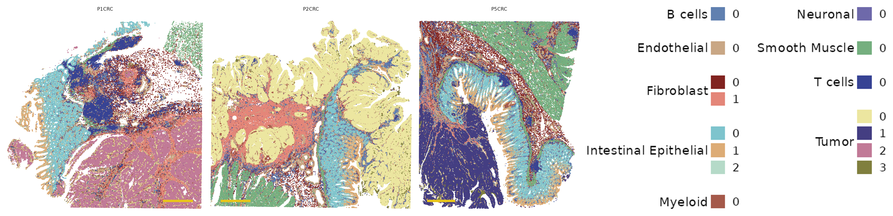
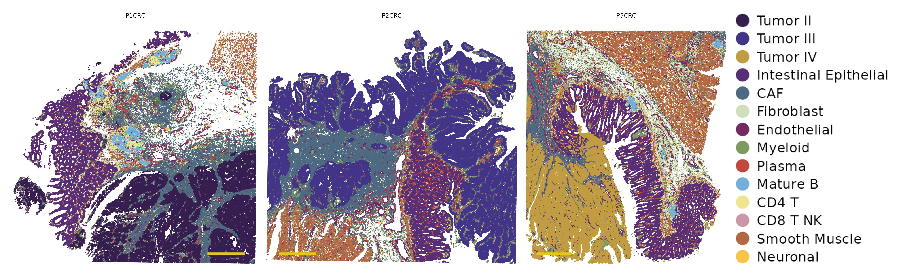
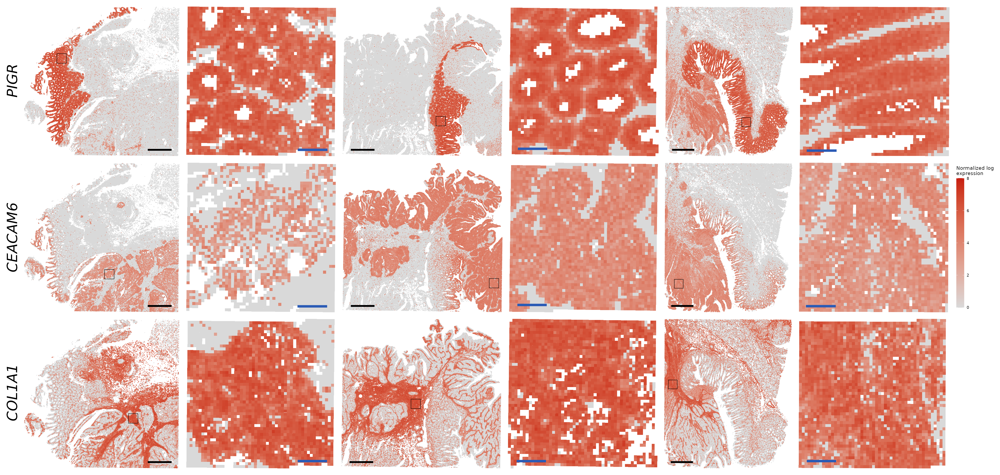
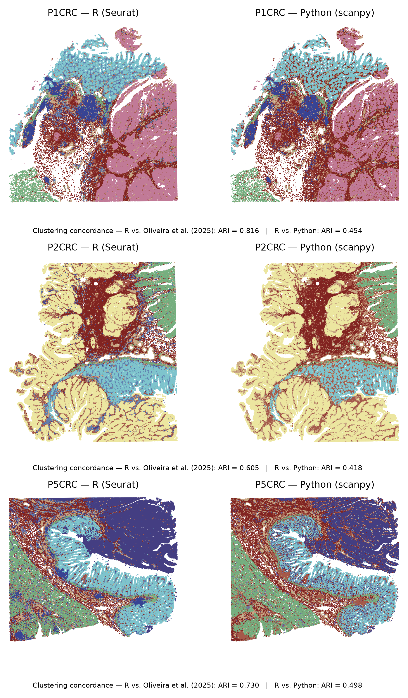
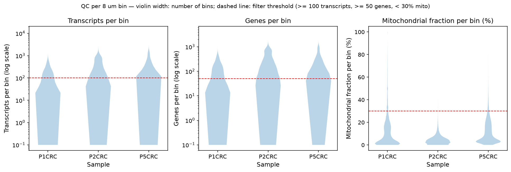

# Reproducing Figure 3 of Oliveira et al. (2025), Visium HD colorectal cancer, Python and R

Reproduction of Figure 3 from Oliveira et al., *High-definition spatial transcriptomic profiling of immune cell populations in colorectal cancer*, Nature Genetics 57, 1512-1523 (2025), with two parallel pipelines: R (Seurat, RCTD) and Python (scanpy). Three patients (P1CRC, P2CRC, P5CRC), 8 um bins, 1,088,534 bins after QC.

## Figures

### Figure 3a. Unsupervised clusters, joint analysis of the three patients



Joint clustering of the three samples (19 clusters).

### Figure 3b. Spatial mapping with deconvolution using single-cell reference



### Figure 3c. Marker gene expression



*PIGR*, *CEACAM6* and *COL1A1*, normalized log expression per bin, with insets.

### R vs. Python



### QC



## Results

Clustering concordance (adjusted Rand index, shared bins):

| Comparison | P1CRC | P2CRC | P5CRC | Overall |
|---|---|---|---|---|
| Joint R vs. Oliveira et al. | 0.816 | 0.605 | 0.730 | - |
| Joint R vs. joint Python | 0.454 | 0.418 | 0.498 | 0.355 |

Deconvolution benchmark (per-bin agreement with the authors' labels, 14-class reference):

| Sample | Agreement |
|--------|-----------|
| P1CRC  | 91.7% |
| P2CRC  | 91.8% |
| P5CRC  | 91.4% |

## Issues found

- The authors' labels use 38 fine subtypes, ours 9 broad classes. Each fine subtype was translated to its broad class (using the authors' own annotation table) before comparing.
- With a pooled B-cell reference, follicular B bins were called T cells; corrected by splitting the reference into 14 classes.
- The 30-class Level2 reference was abandoned (memory and time limits); all runs use the spacexr PR #206 fork.

## Layout

```
R/        analysis scripts (Seurat, RCTD)
python/   analysis scripts (scanpy)
slurm/    job scripts
figures/  final figures (+ pdf/)
results/  cluster identity tables, label map
notes/    daily lab notebook
```

## Data

- Visium HD binned outputs: 10x Genomics public datasets (P1, P2, P5)
- Single-cell reference: Chromium Flex matrix, GEO GSE280318
- Authors' metadata: github.com/10XGenomics/HumanColonCancer_VisiumHD

Details in METHODS.md.
